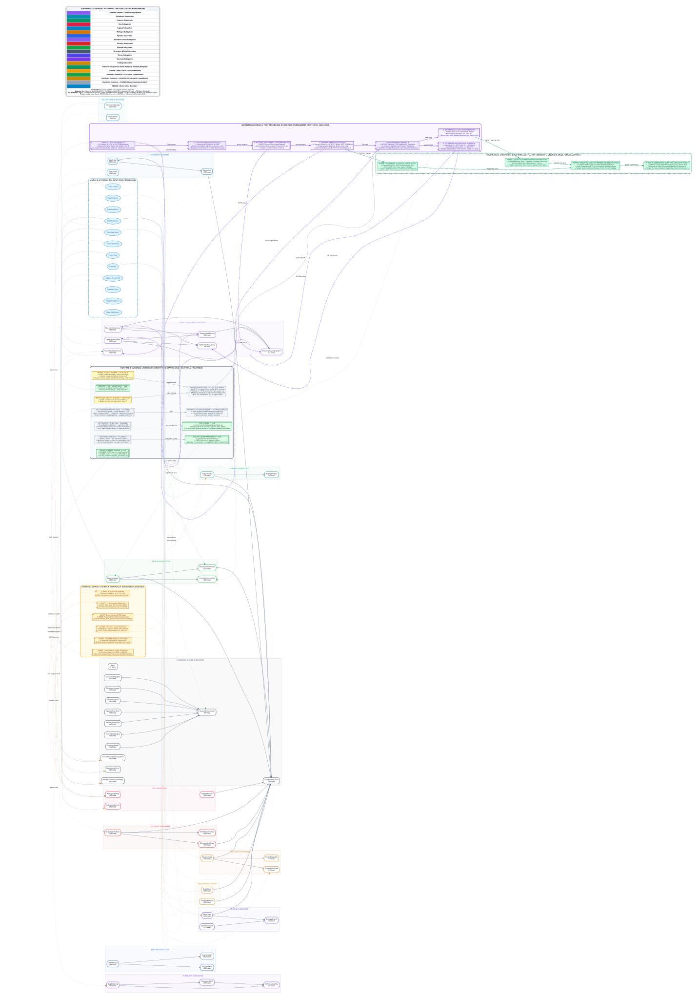

# Vessel_Toy

An experimental computational harness and exploratory probing workspace.

## About

`Vessel_Toy` is a standalone exploratory framework designed for testing synthesized agents, running contextual probes, and inspecting system interactions within isolated environments. It offers an inspectable sandbox to evaluate probe configurations, automated commands, and workflow synthesis.

### Core Modules

- **Agent Synthesis (`agent_synthesizer.py`)**: Harness for setting up test synthesizers and managing interaction agents.
- **Runner (`runner.py`)**: CLI entry point to orchestrate context execution, commands, and probe routines.
- **Probes & Reports (`probes/`, `reports/`)**: Diagnostic routines for gathering runtime traces, telemetry, and structured outputs.
- **Context & Commands (`context/`, `commands/`)**: Modular task definitions and execution scripts.

---

*Note: For deeper technical deep-dives, ongoing development logs, and early research notes, stay tuned via community updates.*
